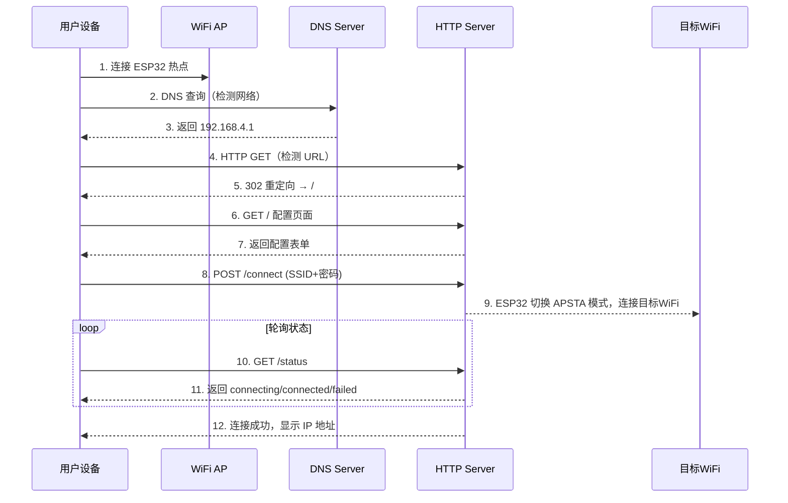

# ESP32 WiFi Config Portal

一个基于 ESP-IDF 开发的 ESP32 WiFi 配网示例项目。通过 Captive Portal（强制门户）实现 WiFi 配网功能——ESP32 创建热点，用户连接后自动弹出配置页面，填写目标 WiFi 的 SSID 和密码，ESP32 随后尝试连接目标网络。

## 功能特性

- **WiFi 热点（SoftAP）**: 自动生成唯一 SSID，支持多设备连接
- **DNS 劫持**: 将所有 DNS 查询重定向到 ESP32 IP 地址
- **Captive Portal**: 设备连接后自动弹出 Web 配置页面
- **WiFi 配网**: 通过表单提交 WiFi 凭据（SSID + 密码），ESP32 连接目标网络
- **APSTA 模式**: 连接目标网络时自动切换为 AP+STA 双模式，保持配置页面可访问
- **状态轮询**: 前端通过 `/status` 接口实时获取连接状态（连接中/成功/失败）
- **错误提示**: 连接失败时显示具体原因（密码错误、找不到 WiFi 等）
- **嵌入式 Web 页面**: HTML 文件嵌入固件，无需外部存储
- **C++ 实现**: 主程序使用 C++ 编写

## 硬件要求

- ESP32 开发板（如 ESP32-DevKitC、ESP-WROVER-KIT 等）
- USB 数据线

## 软件要求

- [ESP-IDF](https://docs.espressif.com/projects/esp-idf/zh_CN/latest/esp32/get-started/index.html) v5.0 或更高版本
- Python 3.8+
- CMake 3.16+

## 快速开始

### 方式一：使用预编译二进制文件（推荐新手）

如果你没有 ESP-IDF 开发环境，可以直接使用预编译的二进制文件通过在线工具烧录。

#### 1. 下载二进制文件

从项目的 `release/merged-binary.bin` 下载预编译的二进制文件。

#### 2. 在线烧录

1. 打开 [ESP Launchpad](https://espressif.github.io/esp-launchpad/) 在线烧录工具
2. 选择对应的 ESP32 芯片型号
3. 点击"Connect"连接设备（需要浏览器支持 Web Serial）
4. 选择下载的 `merged-binary.bin` 文件，设置烧录地址为 `0x0`
5. 点击"Program"开始烧录

> **注意**:
> - 需要使用支持 Web Serial 的浏览器（推荐 Chrome、Edge）
> - 预编译的二进制文件是按照默认配置编译的，如需自定义配置，请使用方式二从源码构建

---

### 方式二：从源码构建（需要 ESP-IDF 环境）

#### 1. 克隆项目

```bash
git clone https://github.com/shenjingnan/esp32-examples.git
cd esp32-examples/examples/02-wifi-config-portal
```

#### 2. 设置 ESP-IDF 环境

```bash
# 如果已安装 ESP-IDF，激活环境
. $HOME/esp/esp-idf/export.sh

# 或使用别名（如果已配置）
get_idf
```

#### 3. 构建项目

```bash
idf.py build
```

#### 4. 烧录到设备

```bash
# 连接 ESP32 开发板，然后执行
idf.py -p PORT flash

# 例如：
# idf.py -p /dev/ttyUSB0 flash   # Linux
# idf.py -p COM3 flash            # Windows
# idf.py -p /dev/tty.usbserial-110 flash  # macOS
```

#### 5. 查看日志输出

```bash
idf.py -p PORT monitor

# 也可以一步完成构建、烧录和监控
idf.py -p PORT flash monitor
```

## 使用方法

1. 烧录完成后，ESP32 会创建一个 WiFi 热点
2. 使用手机或电脑搜索 WiFi，SSID 格式为 `ESP32_WIFI_XXXXXX`（后缀为 MAC 地址后3字节）
3. 连接该 WiFi（无需密码）
4. 大多数设备会自动弹出配置页面；如果没有，打开浏览器访问任意网站即可跳转
5. 在配置页面中填写目标 WiFi 的 SSID 和密码，点击"连接"
6. 页面会自动轮询连接状态，成功后显示目标网络分配的 IP 地址

## 项目结构

```
02-wifi-config-portal/
├── CMakeLists.txt              # 根目录 CMake 配置
├── sdkconfig.defaults          # SDK 默认配置
├── README.md                   # 项目说明文档
├── release/
│   └── merged-binary.bin       # 预编译的二进制文件
├── main/
│   ├── CMakeLists.txt          # main 组件 CMake 配置
│   ├── main.cc                 # 主程序源代码（C++）
│   └── index.html              # 嵌入的 Web 配置页面
└── components/
    └── dns_server/             # 自定义 DNS 服务器组件
        ├── CMakeLists.txt
        ├── dns_server.c
        └── include/
            └── dns_server.h
```

## 技术架构

```
┌─────────────────────────────────────────────────────────────────────┐
│                           ESP32 设备                                 │
├─────────────────────────────────────────────────────────────────────┤
│                                                                     │
│  ┌─────────────┐  ┌─────────────┐  ┌─────────────────────────────┐ │
│  │  WiFi AP    │  │ DNS Server  │  │      HTTP Server            │ │
│  │  (SoftAP)   │  │  (Port 53)  │  │      (Port 80)              │ │
│  │             │  │             │  │                             │ │
│  │ SSID:       │  │ 拦截所有    │  │  ┌───────────────────────┐  │ │
│  │ ESP32_WIFI_ │─▶│ DNS 查询    │─▶│  │ GET /                 │  │ │
│  │ XXXXXX      │  │ 返回本地 IP │  │  │ → index.html 配置页面 │  │ │
│  │             │  │             │  │  ├───────────────────────┤  │ │
│  │ IP:         │  │             │  │  │ POST /connect         │  │ │
│  │ 192.168.4.1 │  │             │  │  │ → 接收凭据,发起连接   │  │ │
│  └─────────────┘  └─────────────┘  │  ├───────────────────────┤  │ │
│                                     │  │ GET /status           │  │ │
│  ┌─────────────┐                    │  │ → 返回连接状态 JSON   │  │ │
│  │  WiFi STA   │                    │  ├───────────────────────┤  │ │
│  │ (连接目标)   │◀───────────────────│  │ 404 → 302 重定向到 / │  │ │
│  └─────────────┘                    │  └───────────────────────┘  │ │
│                                     └─────────────────────────────┘ │
└─────────────────────────────────────────────────────────────────────┘
```

## 工作原理

### WiFi 配网流程



### 核心组件说明

| 组件 | 功能 |
|------|------|
| WiFi AP | 创建开放热点，SSID 基于 MAC 地址生成 |
| WiFi STA | 连接用户指定的目标 WiFi 网络 |
| DNS Server | 将所有 A 记录查询重定向到 ESP32 IP |
| HTTP Server | 提供 Web 配置页面，处理配网请求 |

### HTTP 路由

| 路由 | 方法 | 功能 |
|------|------|------|
| `/` | GET | 返回 WiFi 配置页面 |
| `/connect` | POST | 接收 SSID 和密码，发起 WiFi 连接 |
| `/status` | GET | 返回当前连接状态 JSON |
| 其他 | ANY | 302 重定向到 `/`（Captive Portal） |

## 关键配置参数

| 参数 | 值 | 说明 |
|------|-----|------|
| 初始 WiFi 模式 | `WIFI_MODE_AP` | 启动时为纯 AP 模式 |
| 配网时 WiFi 模式 | `WIFI_MODE_APSTA` | 连接目标网络时切换为 AP+STA |
| SSID 格式 | `ESP32_WIFI_XXXXXX` | MAC 地址后3字节 |
| 认证方式 | `WIFI_AUTH_OPEN` | 热点开放，无密码 |
| 最大连接数 | 4 | 同时最多4个设备 |
| 默认 IP | `192.168.4.1` | ESP-IDF 默认 AP IP |
| DNS 端口 | 53 | 标准 DNS 端口 |
| HTTP 端口 | 80 | 标准 HTTP 端口 |

## 自定义配置

### 修改 Web 页面

编辑 `main/index.html` 文件，修改后重新构建烧录即可。

### 修改 WiFi 热点配置

在 `main/main.cc` 中修改相关参数：

```cpp
wifi_config_t wifi_config = {};
strcpy(reinterpret_cast<char *>(wifi_config.ap.ssid), "你的SSID");
wifi_config.ap.ssid_len = strlen("你的SSID");
wifi_config.ap.max_connection = 8;  // 最大连接数
wifi_config.ap.authmode = WIFI_AUTH_WPA2_PSK;  // 使用密码
strcpy(reinterpret_cast<char *>(wifi_config.ap.password), "你的密码");
```

### 修改 DNS 重定向规则

在 `main/main.cc` 中修改 DNS 服务器配置：

```cpp
dns_server_config_t config = DNS_SERVER_CONFIG_SINGLE("*", "WIFI_AP_DEF");
// "*" 表示匹配所有域名
// 可以指定特定域名，如 "example.com"
```

## 常见问题

### 设备连接后没有自动弹出页面

- 部分设备需要手动打开浏览器访问任意网站
- iOS 设备可能需要等待几秒钟
- Android 设备可能需要点击"登录"或"连接"按钮

### WiFi 连接失败

- **密码错误或认证失败**: 检查输入的 WiFi 密码是否正确
- **找不到指定的 WiFi**: 确保目标 WiFi 在 ESP32 范围内且 SSID 正确
- **握手超时**: 可能是信号太弱，尝试靠近路由器

### 无法连接 ESP32 热点

- 确认 ESP32 已正确烧录
- 检查日志输出确认 WiFi AP 是否正常启动
- 尝试重启 ESP32

### 编译错误

- 确认 ESP-IDF 版本 >= 5.0
- 执行 `idf.py fullclean` 后重新构建
- 检查 Python 依赖是否完整安装

## 参考资料

- [ESP-IDF 编程指南](https://docs.espressif.com/projects/esp-idf/zh_CN/latest/esp32/)
- [ESP32 WiFi 驱动](https://docs.espressif.com/projects/esp-idf/zh_CN/latest/esp32/api-reference/network/esp_wifi.html)
- [ESP HTTP Server](https://docs.espressif.com/projects/esp-idf/zh_CN/latest/esp32/api-reference/protocols/esp_http_server.html)

## 许可证

本项目采用 MIT 许可证，详见 [LICENSE](LICENSE) 文件。
