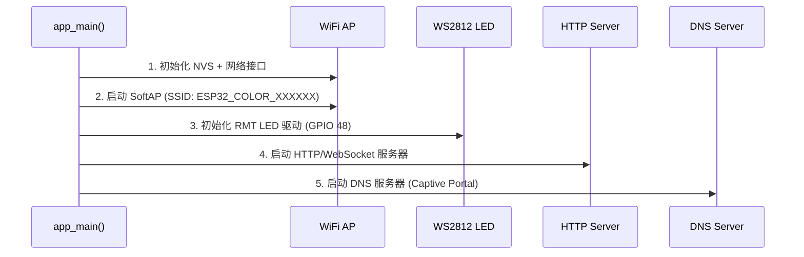
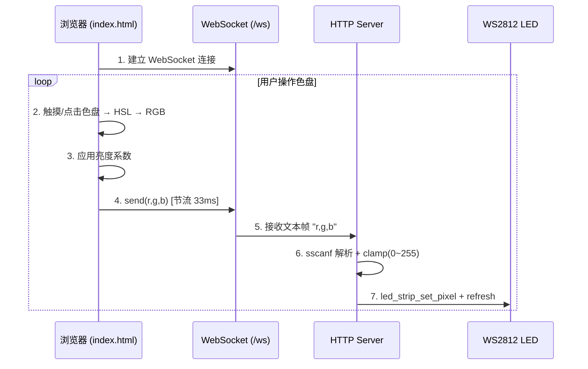

# ESP32 WiFi 色盘控制 LED

基于 ESP-IDF 开发的 ESP32-S3 WiFi 颜色选择器示例。ESP32 创建 WiFi 热点，手机或电脑连接后通过浏览器中的交互式 HSL 色盘选择颜色，实时控制板载 WS2812 RGB LED。

## 功能特性

- **WiFi 热点（SoftAP）**: 自动生成唯一 SSID，支持最多 4 台设备同时连接
- **HSL 色盘界面**: 基于 Canvas 绘制的完整色相-饱和度色盘，支持触摸和鼠标操作
- **亮度调节**: 滑块控制 LED 亮度（5% - 100%）
- **WebSocket 实时通信**: 低延迟颜色数据传输，节流 33ms 避免过载
- **Captive Portal**: 连接 WiFi 后自动弹出色盘页面
- **开关灯按钮**: 一键关闭/恢复 LED
- **自动重连**: WebSocket 断开后 2 秒自动重连

## 硬件要求

- ESP32-S3 开发板（板载 WS2812 RGB LED）
- USB 数据线

> **注意**: 本示例使用 GPIO 48 驱动 WS2812 LED，对应 ESP32-S3 开发板的板载 LED 引脚。

## 软件要求

- [ESP-IDF](https://docs.espressif.com/projects/esp-idf/zh_CN/latest/esp32/get-started/index.html) v5.0 或更高版本
- Python 3.8+
- CMake 3.16+

## 快速开始

### 方式一：使用预编译二进制文件（推荐新手）

如果你没有 ESP-IDF 开发环境，可以直接使用预编译的二进制文件通过在线工具烧录。

#### 1. 下载二进制文件

从项目的 `release/merged-binary.bin` 下载预编译的二进制文件。

#### 2. 在线烧录

1. 打开 [ESP Launchpad](https://espressif.github.io/esp-launchpad/) 在线烧录工具
2. 选择对应的 ESP32 芯片型号（ESP32-S3）
3. 点击"Connect"连接设备（需要浏览器支持 Web Serial）
4. 选择下载的 `merged-binary.bin` 文件，设置烧录地址为 `0x0`
5. 点击"Program"开始烧录

> **注意**:
> - 需要使用支持 Web Serial 的浏览器（推荐 Chrome、Edge）
> - 预编译的二进制文件是按照默认配置编译的，如需自定义配置，请使用方式二从源码构建

---

### 方式二：从源码构建（需要 ESP-IDF 环境）

#### 1. 克隆项目

```bash
git clone https://github.com/shenjingnan/esp32-examples.git
cd esp32-examples/examples/04-wifi-color-picker
```

#### 2. 设置 ESP-IDF 环境

```bash
# 如果已安装 ESP-IDF，激活环境
. $HOME/esp/esp-idf/export.sh

# 或使用别名（如果已配置）
get_idf
```

#### 3. 构建项目

```bash
idf.py build
```

#### 4. 烧录到设备

```bash
# 连接 ESP32-S3 开发板，然后执行
idf.py -p PORT flash

# 例如：
# idf.py -p /dev/ttyUSB0 flash   # Linux
# idf.py -p COM3 flash            # Windows
# idf.py -p /dev/tty.usbserial-110 flash  # macOS
```

#### 5. 查看日志输出

```bash
idf.py -p PORT monitor

# 也可以一步完成构建、烧录和监控
idf.py -p PORT flash monitor
```

## 使用方法

1. 烧录完成后，ESP32-S3 会创建一个 WiFi 热点
2. 使用手机搜索 WiFi，SSID 格式为 `ESP32_COLOR_XXXXXX`（后缀为 MAC 地址后3字节）
3. 连接该 WiFi（无需密码）
4. 大多数设备会自动弹出色盘页面；如果没有，打开浏览器访问任意网站即可跳转
5. 在色盘上滑动选择颜色，拖动滑块调节亮度，点击按钮开关灯

## 项目结构

```
04-wifi-color-picker/
├── CMakeLists.txt                  # 根目录 CMake 配置
├── sdkconfig                       # SDK 配置
├── main/
│   ├── CMakeLists.txt              # main 组件 CMake 配置
│   ├── idf_component.yml           # 组件依赖声明（led_strip）
│   ├── main.cc                     # 主程序入口（WiFi AP + LED 初始化）
│   ├── http_server.cc              # HTTP/WebSocket 服务器实现
│   └── index.html                  # 嵌入的前端色盘界面
└── components/
    └── dns_server/                 # DNS 服务器组件（Captive Portal）
        ├── CMakeLists.txt
        ├── dns_server.c
        └── dns_server.h
```

## 技术架构

```
┌─────────────────────────────────────────────────────────────────────┐
│                        ESP32-S3 设备                                 │
├─────────────────────────────────────────────────────────────────────┤
│                                                                     │
│  ┌──────────────┐   ┌──────────────┐   ┌────────────────────────┐  │
│  │   WiFi AP    │   │  DNS Server  │   │    HTTP Server         │  │
│  │   (SoftAP)   │   │  (Port 53)   │   │    (Port 80)           │  │
│  │              │   │              │   │                        │  │
│  │ SSID:        │   │ 拦截所有     │   │  ┌──────────────────┐  │  │
│  │ ESP32_COLOR_ │──▶│ DNS 查询     │──▶│  │ GET /            │  │  │
│  │ XXXXXX       │   │ 返回本地 IP  │   │  │ → index.html     │  │  │
│  │              │   │              │   │  ├──────────────────┤  │  │
│  │ IP:          │   │              │   │  │ GET /ws (WS)     │  │  │
│  │ 192.168.4.1  │   │              │   │  │ → 接收 r,g,b     │  │  │
│  └──────────────┘   └──────────────┘   │  ├──────────────────┤  │  │
│                                   │   │  │ 404 Handler      │  │  │
│                                   │   │  │ → 302 → /        │  │  │
│                                   │   │  └──────────────────┘  │  │
│                                   │   └────────────────────────┘  │
│                                   │                                │
│  ┌────────────────────────────────────────────────────────────┐   │
│  │                    WS2812 LED (GPIO 48)                    │   │
│  │               RMT 驱动 · GRB 格式 · 单灯                   │   │
│  └────────────────────────────────────────────────────────────┘   │
└─────────────────────────────────────────────────────────────────────┘
```

## 工作原理

### 启动流程



### 颜色控制流程



### 核心组件说明

| 组件 | 文件 | 功能 |
|------|------|------|
| 主程序 | `main/main.cc` | WiFi AP 初始化、LED 初始化、组件编排 |
| HTTP/WebSocket 服务 | `main/http_server.cc` | 静态页面服务、WebSocket 颜色接收、404 重定向 |
| 前端色盘 | `main/index.html` | HSL 色盘绘制、触摸/鼠标交互、亮度滑块、WebSocket 通信 |
| DNS 服务器 | `components/dns_server/` | Captive Portal 支持，拦截所有 DNS 查询 |

### 前端色盘界面

前端是一个完整的单页应用，核心功能：

- **HSL 色盘绘制**: 使用 Canvas `createImageData` 逐像素绘制圆形色相-饱和度色盘
- **颜色拾取**: 支持触摸事件（`touchstart`/`touchmove`）和鼠标事件（`mousedown`/`mousemove`），从画布坐标计算 HSL 值并转换为 RGB
- **亮度控制**: 滑块范围 5%-100%，对基础 RGB 值等比缩放
- **WebSocket 通信**: 发送 `"r,g,b"` 格式文本，33ms 节流防止过载
- **自动重连**: 断开后 2 秒自动尝试重连

## 关键配置参数

| 参数 | 值 | 说明 |
|------|-----|------|
| 目标芯片 | ESP32-S3 | 使用 GPIO 48 板载 LED |
| LED GPIO | `GPIO_NUM_48` | ESP32-S3 开发板 WS2812 数据引脚 |
| LED 型号 | WS2812 | 单灯，GRB 颜色格式 |
| RMT 分辨率 | 10 MHz | LED 时序控制精度 |
| WiFi 模式 | `WIFI_MODE_AP` | 纯接入点模式 |
| SSID 格式 | `ESP32_COLOR_XXXXXX` | MAC 地址后 3 字节（十六进制） |
| 认证方式 | `WIFI_AUTH_OPEN` | 开放网络，无密码 |
| 最大连接数 | 4 | 同时最多 4 台设备 |
| 默认 IP | `192.168.4.1` | ESP-IDF 默认 AP IP |
| HTTP 端口 | 80 | 标准 HTTP 端口 |
| WebSocket 路径 | `/ws` | 颜色数据接收端点 |
| WebSocket 协议 | `"r,g,b"` 文本 | RGB 值逗号分隔，范围 0-255 |
| 发送节流 | 33ms (~30fps) | 前端防抖，避免 WebSocket 过载 |
| 亮度范围 | 5% - 100% | 最小 5% 防止完全不可见 |
| DNS 端口 | 53 | 标准 DNS 端口 |

## 自定义配置

### 修改 LED 引脚

在 `main/main.cc` 中修改 GPIO 引脚号：

```cpp
static constexpr gpio_num_t kLedGpio = GPIO_NUM_48;  // 改为你的引脚
```

### 修改 WiFi 配置

在 `main/main.cc` 的 `wifi_init_softap()` 函数中修改：

```cpp
// 自定义 SSID
strcpy(reinterpret_cast<char *>(wifi_config.ap.ssid), "我的LED");
wifi_config.ap.ssid_len = strlen("我的LED");

// 设置密码
wifi_config.ap.authmode = WIFI_AUTH_WPA2_PSK;
strcpy(reinterpret_cast<char *>(wifi_config.ap.password), "12345678");

// 修改最大连接数
wifi_config.ap.max_connection = 8;
```

### 修改 Web 页面

编辑 `main/index.html` 文件，修改后重新构建烧录即可。HTML 文件通过 `EMBED_FILES` 编译进固件，不依赖外部存储。

### 修改 LED 数量

在 `main/main.cc` 的 `init_led()` 函数中：

```cpp
strip_config.max_leds = 1;  // 修改为你的 LED 数量
```

同时在 `http_server.cc` 的 `ws_handler()` 中调整 `led_strip_set_pixel` 的索引：

```cpp
led_strip_set_pixel(s_led_strip, 0, r, g, b);  // 0 改为对应 LED 索引
```

## 常见问题

### 连接 WiFi 后没有自动弹出页面

- 部分设备需要手动打开浏览器访问任意网站
- iOS 设备可能需要等待几秒钟
- Android 设备可能需要点击"登录"或"连接"按钮

### 色盘上选色但 LED 不亮

- 确认开发板型号为 ESP32-S3（GPIO 48 对应其板载 LED）
- 如果使用其他开发板，需修改 `kLedGpio` 为正确的引脚号
- 检查串口日志确认 LED 是否初始化成功

### WebSocket 显示"已断开"

- 正常现象：页面会每 2 秒自动重连
- 如果持续断开，检查设备是否仍在同一 WiFi 下
- 尝试刷新浏览器页面

### 颜色变化有延迟

- 前端设置了 33ms 节流（约 30fps），这是正常设计用于防止过载
- 如需更流畅可减小 `DT` 值，但可能增加 WebSocket 负担

### 编译错误

- 确认 ESP-IDF 版本 >= 5.0
- 执行 `idf.py fullclean` 后重新构建
- 确认 `managed_components/espressif__led_strip/` 已正确下载

## 参考资料

- [ESP-IDF 编程指南](https://docs.espressif.com/projects/esp-idf/zh_CN/latest/esp32/)
- [ESP32 WiFi 驱动](https://docs.espressif.com/projects/esp-idf/zh_CN/latest/esp32/api-reference/network/esp_wifi.html)
- [ESP HTTP Server](https://docs.espressif.com/projects/esp-idf/zh_CN/latest/esp32/api-reference/protocols/esp_http_server.html)
- [ESP LED Strip 驱动](https://docs.espressif.com/projects/esp-led-strip/en/latest/)
- [RMT (Remote Memory Transfer)](https://docs.espressif.com/projects/esp-idf/zh_CN/latest/esp32/api-reference/peripherals/rmt.html)

## 许可证

本项目采用 GNU GPL v3 许可证，详见 [LICENSE](../../LICENSE) 文件。
